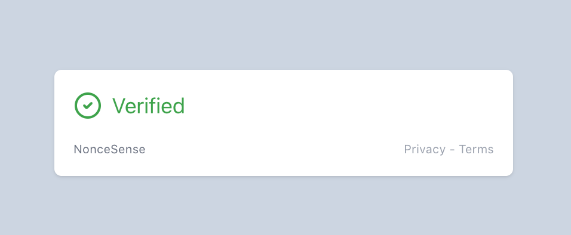

# NonceSense

<p align="left">
  
</p>

Most CAPTCHAs rely on invasive tracking, third-party APIs, or inaccessible image-based tests. **NonceSense** is built differently — with a **privacy-first, self-hostable** approach:

* 100% self-hosted — no Google or external services
* No tracking, no cookies, no user data collection
* Verifies in one lightweight API roundtrip
* Based on open cryptographic puzzles, not proprietary scoring
* Clean, familiar UI — feels like a modern CAPTCHA without surveillance

**Ideal for protecting:**

* Public APIs from abuse
* Contact and signup forms
* Serverless or edge functions
* Any app where privacy and security matter

**NonceSense** is a Proof-of-Work (PoW) CAPTCHA that uses cryptographic puzzles instead of image-based tests. Designed for bots to hate and devs to love — it’s fast, lightweight, and privacy-respecting.

> _"A CAPTCHA so minimal, it only needs math."_

## Tech Stack

- **Python** backend with **FastAPI**
- **SHA256** / **BLAKE3** hashing
- REST API for challenge issuance and verification
- **Valkey** (Redis-compatible open source fork) for temporary challenge tracking
- **WASM**-powered PoW solver on the frontend
- **JavaScript fallback** for older browsers
- **React widget** styled like Google CAPTCHA
- **.env-based rate limiting**, dynamic difficulty, and expiration feedback

## How It Works

1. Client requests a challenge from the API
2. Server returns a challenge string + required difficulty
3. Client finds a nonce such that  
   `hash(challenge + nonce)` starts with `n` zeroes
4. Server verifies the hash and grants access if valid

## Quickstart

### Local Development Setup

You can either use Docker Compose for convenience or start each service manually.

#### Option 1: Docker Compose (recommended)

```bash
git clone https://github.com/babanomania/NonceSense.git
cd noncesense

# Start backend, frontend, and Valkey together
docker-compose up --build
```

#### Option 2: Manual Setup

Make sure your `.env` file is in place for the backend, with entries like:

```env
VALKEY_URL=redis://localhost:6379/0
POW_DIFFICULTY=4
CHALLENGE_TTL=120
RATE_LIMIT=10
RATE_WINDOW=60
```

Run each service individually:

```bash
# Valkey
docker run -p 6379:6379 valkey/valkey

# Backend
cd backend
python -m venv venv
source venv/bin/activate
pip install -r requirements.txt
uvicorn app.main:app --host 0.0.0.0 --port 8000 --reload

# Frontend (Static HTML + JS)
cd ../frontend
python3 -m http.server 3000
```

Then access the frontend at [http://localhost:3000](http://localhost:3000) and backend at [http://localhost:8000](http://localhost:8000).

## API Endpoints

### `POST /challenge`

Returns a new challenge:

```json
{
  "challenge": "a1f2c5e9...",
  "difficulty": 4,
  "expires_in": 120
}
```

### `POST /verify`

Submit your solution:

```json
{
  "challenge": "a1f2c5e9...",
  "nonce": "000438",
  "hash_algo": "sha256"
}
```

Response:

```json
{
  "success": true,
  "message": "Valid solution."
}
```

## Frontend (WASM Solver)

Client computes PoW in-browser using:

- WebAssembly (Rust-based solver)
- Fallback to JavaScript for legacy support
- React component (`<NonceCaptcha />`) styled like Google CAPTCHA
- Spinner, error states, refresh button, and expiration messages

## Pluggable React Widget

The sample React project is located in:

```bash
frontend/react-example
```

You can try it locally:

```bash
cd frontend/react-example
npm install
npm run dev
```

Then use the widget like this:

```tsx
<NonceCaptcha
  apiUrl="https://your-backend-url"
  onVerify={({ challenge, nonce }) => console.log("Verified!", challenge, nonce)}
/>
```

Optional offline mode coming soon.

---

## Roadmap

- [x] Dynamic difficulty scaling
- [x] Challenge expiration feedback
- [x] Plug-in frontend widget (React)
- [x] WASM + JS fallback solver
- [x] Rate limiting via .env
- [ ] Offline verification for serverless use cases
- [ ] Vue/Svelte wrapper

---

## License

MIT License — use it freely, break bots peacefully.

